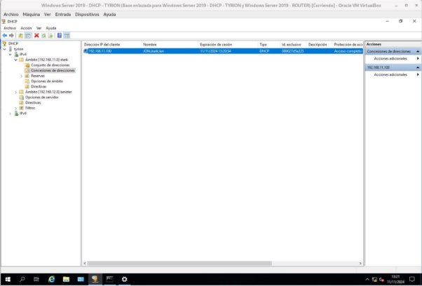

Os equipos ned, rob serán os servidores dns para o dominio stark.lan (Debian) e tywin para lanister.lan (Windows)

Instala no equipo tyrion (Windows) o rol de servidor DHCP coa seguinte configuración: (deberás ter apagados os servidores DHCP do punto anterior)

Un ámbito para os equipos da rede privada lanister, con un intervalo de exclusión.

Deberás crear unha reserva estática que estará no rango de enderezos do seu ámbito correspondente.

Establece os nomes de dominio e servidores DNS primario de cada zona.

Deberás actualizar a zona primaria no servidor DNS tywin.

Engade outro ámbito para a rede primaria stark (necesitas outra interface de rede) que actualice a zona prinaria DNS definida no equipo arya.

Instala no equipo jaime un servizo DHCP failover para a subrede lanister.

Necesitarás polo menos tres clientes (Cercei,Joffrey, Myrcella) para a rede lannister e un para a rede stark (jon).

Inclúe capturas de:

- Configuración dos ambitos e rangos de enderezos
- Configuración de opcións
- Configuración da actualización
- Vídeo no que o cliente renova a concesión, e se ve a zona DNS unha vez que o DHCP actualiza o DNS. Tamén o cliente debe ser capaz de resolver o seu propio nome (non FQDN).
- Clientes das dúas subredes, amosando DNS, router e enderezo IP.
- Configuración dos servidores failover
- Capturas dos clientes obtendo enderezos cos dous servidores failover encendidos, e con un acendido e outro apagado (de forma alterna)

Elimina a interface de rede 192.168.11.8 de tyrion, e configura o servizo DHCP Relay no router. Comproba que os equipos da rede stark.lan reciben a configuración de rede de xeito correcto. Inclúe as capturas necesarias.

Actualizacion arya zona directa

Actualizacion arya zona inversa

Registro JON automatico, zona directa.

Registro JON automatico zona inversa.

CONFIFURACION DHCP CLIENTES

\*\*\*\*\*\*\*\*\*\*\*\*\*\*\*\*\*\*\*\*\*\*\*\*\*\*\*\*\*\*\*\*\*\*\*\*\*\*\*\*\*\*\*\*\*\*\*\*\*\*\*\*\*\*\*\*\*\*\*\*\*\*\*\*\*\*\*\*\*\*\*\*\*\*\*\*\*\*\*\*\*\*\*\*\*\*\*\*\*\*\*\*\*\*\*\*\*\*\*\*\*\*\*\*\*

Conmutación por error del dhcp jaime. (Para el dhcp failover)

DHCP desde 192.168.12.8

Parando el DHCP 192.168.12.8

DHCP desde el failover 192.168.12.9

Configuracion DHCP recibida por el DHCP Relay

Configuracion DHCP dada desde el DHCP principal.

Cliente recibiendo configuracion DHCP desde servidor principal.

